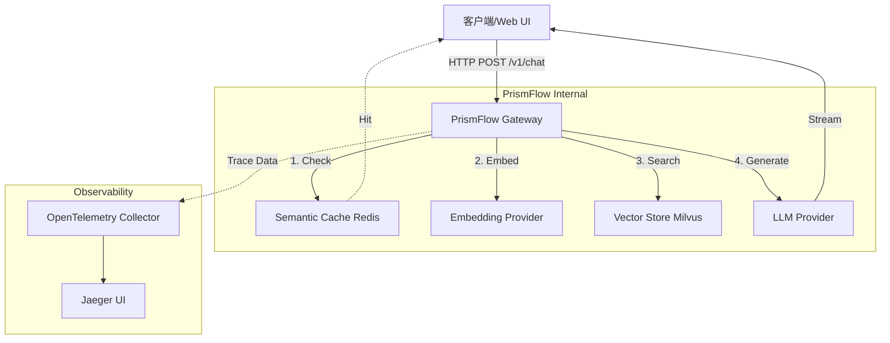

# PrismFlow 🔮

PrismFlow 是一个高性能、可观测的 **RAG（检索增强生成）网关**，采用 Go 语言编写。它旨在为 LLM 应用提供统一的接入层，内置了语义缓存、向量检索编排、流式响应以及全链路追踪能力。


## ✨ 核心特性

- **🚀 高性能 RAG 编排**：自动处理 Embedding、向量检索（Vector Search）和 LLM 生成流程。
- **🧠 语义缓存 (Semantic Cache)**：基于语义相似度缓存 LLM 响应（Redis），显著降低延迟和 Token 成本。
- **🌊 流式响应 (SSE)**：原生支持 Server-Sent Events，提供打字机式的流畅体验。
- **🔌 多模型支持**：
  - **LLM**: OpenAI, DeepSeek
  - **Embedding**: OpenAI, Ollama (本地部署)
  - **VectorDB**: Milvus
- **👀 全链路可观测性**：集成 OpenTelemetry，支持 Jaeger 查看完整的 RAG 链路瀑布图（Embedding -> Search -> Generation）。
- **🖥️ 内置 Web UI**：提供开箱即用的对话测试界面。

## 🏗️ 架构概览



## 🛠️ 快速开始

### 前置要求

- Go 1.21+
- Docker & Docker Compose

### 1. 启动基础设施

使用 Docker Compose 启动 Redis, Milvus 和 Jaeger：

```bash
cd internal/deployment
docker-compose up -d
```

### 2. 配置项目

复制配置文件并根据需要修改：

```bash
cp configs/config.yaml configs/config.yaml.example
# 编辑 configs/config.yaml 设置你的 API Key
```

示例配置 (`configs/config.yaml`):

```yaml
server:
  port: 8080
  name: "rag-gateway"

llm:
  provider: "deepseek" # 或 "openai"
  api_key: "your-api-key"
  model: "deepseek-chat"

embedding:
  provider: "openai" # 或 "ollama"
  api_key: "your-api-key"

vector_db:
  provider: "milvus"
  address: "localhost:19530"
  collection: "rag_documents"
  dimension: 1536

redis:
  addr: "localhost:6379"
  password: ""

trace:
  endpoint: "localhost:4318" # OTLP HTTP
```

### 3. 运行服务

```bash
go mod tidy
go run cmd/main.go
```

服务启动后：
- **Web UI**: [http://localhost:8080](http://localhost:8080)
- **API Endpoint**: `http://localhost:8080/v1/chat`
- **Jaeger UI**: [http://localhost:16686](http://localhost:16686)

## 📖 使用指南

### Web 界面

直接在浏览器访问 `http://localhost:8080`，即可使用内置的聊天界面进行测试。界面支持流式输出显示和实时性能指标（TTFT、总耗时、Token 速率）。

### API 调用

```bash
curl -X POST http://localhost:8080/v1/chat \
  -H "Content-Type: application/json" \
  -d '{"query": "什么是 RAG 架构？"}'
```

响应为 SSE (Server-Sent Events) 格式。

## 🔍 可观测性

PrismFlow 内置了详细的 OpenTelemetry 埋点。访问 Jaeger UI ([http://localhost:16686](http://localhost:16686)) 可以查看每个请求的完整链路，包括��

- **SemanticCache.Check**: 缓存检查耗时
- **Embedding**: 向量化耗时
- **VectorSearch**: 数据库检索耗时
- **LLMGeneration**: 大模型首字延迟 (TTFT) 和生成速率

## 🧪 测试

运行单元测试和集成测试：

```bash
go test ./... -v
```

## 🤝 贡献

欢迎提交 Issue 和 Pull Request！

## 📄 许可证

MIT License

